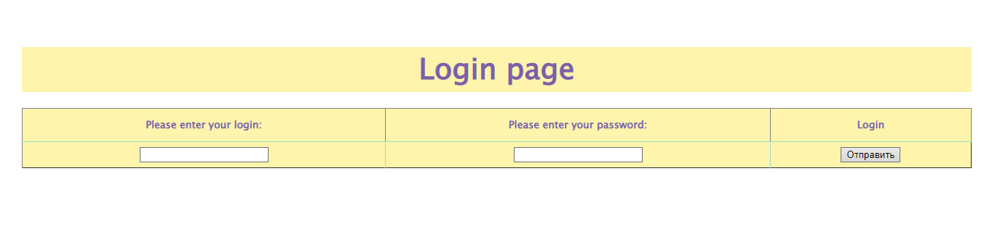
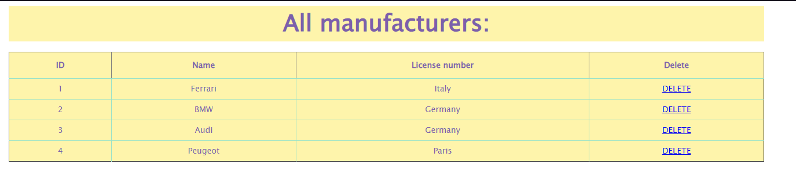

# 🚖Taxi-Service🚖
## Project description:
A simple web-application that supports authentication, registration and other CRUD operations.
## 🎓Features🎓:
* create/update/remove a car;
* create/update/remove a driver;
* create/update/remove a manufacturer;
* display list of all manufacturers;
* display list of all cars;
* display list of all drivers;
* registration like driver
* authentication like a driver;
## Some examples:
### Login page:
* 
### Home page:
* 
### Display list of all manufacturers:
* 
## 💻Technologies💻
* JDK 11
* Maven 4.0
* MySql 8.0.31
* TomCat 9.0.50
* JDBC
* Javax servlet 4.0.1
* JSTL 1.2
* HTML/CSS
## 💼Instructions for launching the project 💼
* Clone this project on your PC
* Copy data from [init_db.sql](src/main/resources/init_db.sql) to DB
* Download Tomcat 9.0.50
* Configure parameters at this file [ConnectionUtil](src/main/java/taxi/util/ConnectionUtil.java)
* Configure your TomCat and run server

